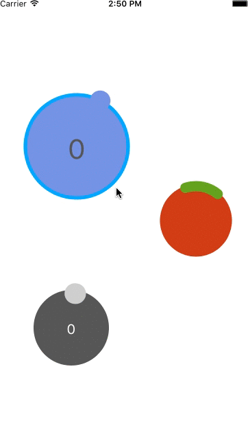

# WheelSlider
It will provide an interface to rotation

##Demo


##Usage

###InterfaceBuilder
Please create Square View.

###Code

Width and Height, please be the same
```
let wheelslider = WheelSlider(frame: CGRectMake(0, 0, 100, 100))
self.view.addSubview(wheelslider)
```

##Value notification
When the slider is moved , it will notify the value.

###Delegate
```
protocol WheelSliderDelegate{
    func updateSliderValue(value:Double,sender:WheelSlider) -> ()
}
```

###CallBack
```
public var callback : ((Double) -> ())?
```

##Variable

```
@IBInspectable public var speed:Int
```
Rotational speed.
Since the smaller the value is fast note.

```
@IBInspectable public var backStrokeColor : UIColor
```
The color of the frame of the circle that becomes the background

```
@IBInspectable public var backFillColor : UIColor
```
Of the circle that becomes the background color

```
@IBInspectable public var backWidth : CGFloat
```
The thickness of the frame of the circle that becomes the background

```
@IBInspectable public var knobStrokeColor : UIColor
```
The color of the knob

```
@IBInspectable public var knobWidth : CGFloat
```
The thickness of the knob

```
@IBInspectable public var knobLength : CGFloat
```
The length of the knob

```
public var knobLineCap = WSKnobLineCap.WSLineCapRound

public enum WSKnobLineCap{
    case WSLineCapButt
    case WSLineCapRound
    case WSLineCapSquare
}
```
Kind of knob line cap.

```
@IBInspectable public var maxVal:Int
```
The maximum number of counts
This parameter is insect if 'isLimited' is false

```
@IBInspectable public var isLimited:Bool
```
This parameter will continue to grow forever If the value is false

```
@IBInspectable public var allowNegativeNumber:Bool
```
This parameter allows a negative number if true

```
@IBInspectable public var isValueText:Bool
```
It will display the character that represents the current parameters in the middle of the circle

```
@IBInspectable public var valueTextColor:UIColor
```
Color of the text indicating the current numeric

```
@IBInspectable public var valueTextFontSize:CGFloat
```
The font size of a character indicating the current numeric

##Installation
・Copying file
・Using Submodule

##License
MIT License


